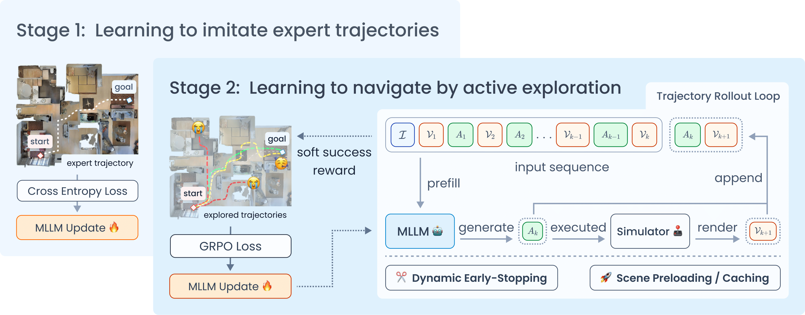

<div align="center">
  <h1 style="font-size: 32px; font-weight: bold;"> ActiveVLN: Towards Active Exploration via Multi-Turn RL in Vision-and-Language Navigation</h1>

  <br>

  <a href="https://arxiv.org/abs/2509.12618">
    
  </a>
  <a href="https://huggingface.co/collections/Arvil/activevln-68e7367d8bd2b426985f0c4a">
    
  </a>
</div>


## ActiveVLN
ActiveVLN is a Vision-and-Language Navigation (VLN) framework designed to enable **active exploration** through multi-turn reinforcement learning. Unlike traditional VLN methods, which rely on imitation learning and expert trajectories, ActiveVLN empowers the navigation agent to engage in open-ended exploration, improving its ability to discover diverse and plausible navigation paths.

ActiveVLN follows a two-stage process:
1. Initial Stage: The agent is bootstrapped using a small set of expert trajectories via imitation learning.
2. Active Exploration: In the second stage, the agent iteratively predicts and executes actions while collecting diverse navigation trajectories. These trajectories are then optimized using the GRPO objective, with a dynamic early-stopping strategy to prune unpromising paths.



## 📝 TODO List

- ✅ Submit the arXiv paper (Sep. 12, 2025)
- ✅ Publish model checkpoints
- ✅ Release evaluation scripts
- ✅ Release training code and data
- ✅ Release environment server code

##  Quick Start
ActiveVLN separates the training code from the VLN-CE environment code to improve efficiency and resource usage. The training machine and the VLN-CE environment server communicate via HTTP. Therefore, you'll need to set up two separate environments: one for running the training code and another for the environment server. If resources (memory, GPU memory) allow, you can run both parts on the same machine.


### Setup the VLN-CE Environemnt

```bash
# Create an environment for VLN-CE server
conda create -n server python=3.10 -y
conda activate server

mkdir nav_ws
cd nav_ws

# Install habitat-sim v0.1.7 (building from source)
git clone --branch v0.1.7 https://github.com/facebookresearch/habitat-sim.git
cd habitat-sim
pip install -r requirements.txt
python setup.py install --headless

# The following versions are specified to prevent a known segmentation fault
pip install numpy==1.23.0 numba==0.60.0

# Test habitat-sim installation by running an example
python examples/examples.py

# Install habitat-lab v0.1.7 (building from source)
cd ..
git clone --branch v0.1.7 https://github.com/facebookresearch/habitat-lab.git
cd habitat-lab
pip install -r requirements.txt
pip install -r habitat_baselines/rl/requirements.txt
pip install -r habitat_baselines/rl/ddppo/requirements.txt
pip install dtw fastdtw gym==0.17.3
python setup.py develop --all

# The following versions are specified to prevent a known segmentation fault
pip install numpy==1.23.0 numba==0.60.0

# Install vlnce_server package
cd ..
git clone https://github.com/arvillion/ActiveVLN
cd ActiveVLN
pip install -e ./vlnce_server
```

### Setup the Training Environment
```bash
# Create an environment for RL training
conda conda create -n train python=3.10 -y
conda activate train

git clone https://github.com/arvillion/ActiveVLN
cd ActiveVLN

# Follow the VeRL official installation procedure
pip install --no-deps -e .

# Install additional dependencies
bash scripts/install_activevln.sh

# Install the vlnce_server package for the client interface
pip install -e ./vlnce_server
```

### Data Preparation
On the **environment server side**, you must prepare two types of data to use the simulator:

1. Scene Dataset: Download the [Matterport3D](https://niessner.github.io/Matterport/) dataset and extract it to `data/scene_datasets/mp3d/`.
2. VLN-CE Episodes: These contain instructions and trajectory annotations. Download and extract them into the `data/datasets/` directory.

    - [R2R](https://drive.google.com/file/d/1fo8F4NKgZDH-bPSdVU3cONAkt5EW-tyr/view)
    - [RxR](https://drive.google.com/file/d/145xzLjxBaNTbVgBfQ8e9EsBAV8W-SM0t/view)

Your final folder structure should look like this:
```
data/
├── datasets/
│   ├── R2R_VLNCE_v1-3_preprocessed/
│   │   ├── train/
│   │   ├── val_seen/
│   │   │   └── val_seen.json.gz
│   │   └── val_unseen/
│   │       └── val_unseen.json.gz
│   ├── RxR_VLNCE_v0/
│   │   ├── train/
│   │   ├── val_seen/
│   │   │   ├── val_seen_guide.json.gz
│   │   │   └── ...
│   │   └── val_unseen/
│   │       ├── val_unseen_guide.json.gz
│   │       └── ...
└── scene_datasets/
    └── mp3d/
        ├── 17DRP5sb8fy/
        ├── 1LXtFkjw3qL/
        └── ...
```
On the training side, the required data (`data/r2r_4000_train.parquet` and `data/rxr_4000_train.parquet`) is already included in this repository, containing 4000 trajectories each from R2R and RxR datasets for RL training.

### Launch the Environment Server
```bash
conda activate server

python3 -m vlnce_server.server \
    server.host=0.0.0.0 \
    server.port=5001 \
    vlnce.gpus=[0,1] \
    vlnce.r2r_gpu_plan=[16,16] \
    vlnce.rxr_gpu_plan=[0,0]
```

- `vlnce.gpus` specifies the GPUs on which to launch the simulators.
- `vlnce.r2r_gpu_plan` and `vlnce.rxr_gpu_plan` define the simulator allocation on each GPU.

The example configuration above launches 32 R2R simulators in parallel across GPU 0 and GPU 1, with 16 simulators allocated to each.

### Start RL Training
This repository provides the code for RL training, and we offer a fine-tuned SFT checkpoint to serve as a starting point for RL. 
If you wish to perform SFT yourself, please refer to the *For SFT Reference* section.

The training code and configuration are designed to run on 4x NVIDIA L40s GPUs (48GB) with 512GB of CPU RAM. The environment server runs 32 VLN-CE simulators in parallel.

Step 1: **Prepare the Post-SFT Model**: 
RL training builds upon an SFT checkpoint. You can either download our pre-trained checkpoints or fine-tune one yourself. We provide two checkpoints for RL training on R2R and RxR, respectively.

- [`Qwen2.5-VL-3B_sft_r2r_envdrop_multiturn`](https://huggingface.co/Arvil/Qwen2.5-VL-3B_sft_r2r_envdrop_multiturn): Fine-tuned on the R2R and R2R-EnvDrop datasets. Use this as the base model for RL training on R2R.
- [`Qwen2.5-VL-3B_sft_r2r_envdrop_rxr_multiturn`](https://huggingface.co/Arvil/Qwen2.5-VL-3B_sft_r2r_envdrop_rxr_multiturn): Fine-tuned on the R2R, R2R-EnvDrop, and RxR datasets. Use this as the base model for RL training on RxR.

Step 2: **Start Training**: Run one of the following scripts to begin training on your chosen dataset:

```bash
# Training on the R2R dataset
bash examples/vlnce/train_r2r.sh

# Training on the RxR dataset
bash example/vlnce/train_rxr.sh
```

## Checkpoints
We provide several checkpoints:
- [`Qwen2.5-VL-3B_sft_r2r_envdrop_multiturn`](https://huggingface.co/Arvil/Qwen2.5-VL-3B_sft_r2r_envdrop_multiturn): Fine-tuned on R2R and R2R-EnvDrop. This is the base model for RL training on R2R (achieves SR ~38.5).
- [`Qwen2.5-VL-3B_rl_r2r_4000`](https://huggingface.co/Arvil/Qwen2.5-VL-3B_rl_r2r_4000): The result of RL training on `data/r2r_4000_train.parquet` (step 350), built upon the SFT checkpoint above.
- [`Qwen2.5-VL-3B_sft_r2r_envdrop_rxr_multiturn`](https://huggingface.co/Arvil/Qwen2.5-VL-3B_sft_r2r_envdrop_rxr_multiturn): Fine-tuned on the R2R, R2R-EnvDrop, and RxR datasets. This is the base model for RL training on RxR (achieves SR ~41.0).
- [`Qwen2.5-VL-3B_rl_rxr_4000_step350`](https://huggingface.co/Arvil/Qwen2.5-VL-3B_rl_rxr_4000_step350): The result of RL training on `data/rxr_4000_train.parquet` (step 350), built upon the SFT checkpoint above.


## For SFT Reference

We do not provide the codebase for SFT. However, if you wish to create your own base model for RL, you can refer to the following details:

- SFT Base Model: [Qwen-2.5-VL-3B-Instruct](https://huggingface.co/Qwen/Qwen2.5-VL-3B-Instruct)
- For R2R Training: The [`Qwen2.5-VL-3B_sft_r2r_envdrop_multiturn`](https://huggingface.co/Arvil/Qwen2.5-VL-3B_sft_r2r_envdrop_multiturn) checkpoint was trained on the [R2R](https://drive.google.com/file/d/1fo8F4NKgZDH-bPSdVU3cONAkt5EW-tyr/view) and [R2R-EnvDrop](https://drive.google.com/file/d/1fo8F4NKgZDH-bPSdVU3cONAkt5EW-tyr/view) dataset.
- For RxR Training: The [`Qwen2.5-VL-3B_sft_r2r_envdrop_rxr_multiturn`](https://huggingface.co/Arvil/Qwen2.5-VL-3B_sft_r2r_envdrop_rxr_multiturn) was trained on the datasets above, plus the [RxR](https://huggingface.co/datasets/cywan/StreamVLN-Trajectory-Data/tree/main/RxR) dataset, which was collected by [StreamVLN](https://github.com/InternRobotics/StreamVLN) and converted to the R2R action space.

Ensure you use the appropriate system prompt. You can use frameworks like [transformers](https://github.com/huggingface/transformers), [LLaMA-Factory](https://github.com/hiyouga/LLaMA-Factory) or other training frameworks to do SFT.


## Evaluation
We provide an evaluation script based on vllm for fast inference. To begin, first start the model serving endpoint as follows:

```bash
vllm serve $MODEL_PATH --task generate \
  --trust-remote-code \
  --limit-mm-per-prompt image=200,video=0 \
  --mm_processor_kwargs '{"max_pixels": 80000}' \
  --max-model-len 32768 \
  --enable-prefix-caching \
  --disable-log-requests \
  --port 8003
```
Replace `$MODEL_PATH` with the path to the model you wish to evaluate.

Once the inference service is running, you can initiate the evaluation using `examples/vlnce/eval_r2r.sh` or `examples/vlnce/eval_rxr.sh`. Before running, you must modify the essential variables in the script. For example, `examples/vlnce/eval_r2r.sh` looks like this:

```bash
SAVE_PATH=eval_results/r2r/example
CHUNKS=32
CONFIG_PATH="vlnce_server/VLN_CE/vlnce_baselines/config/r2r_baselines/activevln_r2r_test.yaml"

export OPENAI_API_KEY="EMPTY"
export OPENAI_API_BASE="http://127.0.0.1:8003/v1"
export PYTHONPATH=$PYTHONPATH:"$(pwd)/vlnce_server"

python3 eval/vlnce/eval_vlnce.py \
    --exp-config $CONFIG_PATH \
    --split-num $CHUNKS \
    --result-path $SAVE_PATH

# Score calculation
python3 eval/vlnce/analyze_results.py \
    --path $SAVE_PATH
```

Make sure to edit the following:

- `OPENAI_API_BASE` and `OPENAI_API_KEY` should match your model serving configuration.
- Set `SAVE_PATH` to the desired location where you want to save the evaluation results.
- (Optional) `CHUNKS` defines the number of simulators that will run in parallel.


## Acknowledgements
We would like to thank the authors of [verl](https://github.com/volcengine/verl) and [DeepEyes](https://github.com/Visual-Agent/DeepEyes), upon whose work our code builds. Special thanks to [VAGEN](https://github.com/RAGEN-AI/VAGEN), which inspired the logic for our environment server.

## Citation
If you find our work useful, please consider starring this repo 🌟 and citing our paper:
```
@article{zhang2025activevln,
  title={ActiveVLN: Towards Active Exploration via Multi-Turn RL in Vision-and-Language Navigation},
  author={Zhang, Zekai and Zhu, Weiye and Pan, Hewei and Wang, Xiangchen and Xu, Rongtao and Sun, Xing and Zheng, Feng},
  journal={arXiv preprint arXiv:2509.12618},
  year={2025}
}
```
